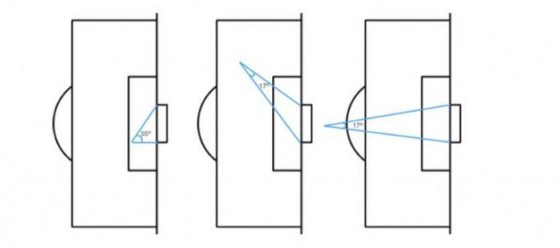

# ST308-Project

## Aim: 

Use Bayesian methods to model the effects of various factors on the liklehood of a goal.

## Data: 

https://www.kaggle.com/datasets/aleespinosa/soccer-match-event-dataset

## Target Variable:

Binary variable (`is_goal`) indicating goal(1) or not(0).

## Predictors:
 - Binary variable describing whether the shot was part of a break (`is_CA`) 
 - Categorical variable describing what part of the body produced the shot (`body_part`)
 - Distance from the goal line (`dist`)
 - Angle to goal, below is an example of the angle described (`angle`)
 
 
 
## Heirarchical Features:
 - We could add a grouping to the data through individual players (`playerId`)
 
